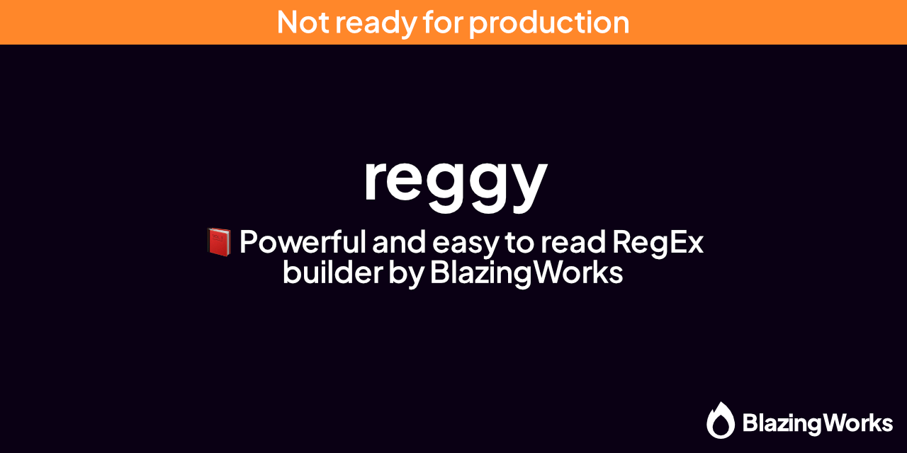

# reggy

<div align="center">




</div>

## What is Reggy?

Reggy is a powerful and easy to read RegEx builder. It is attempting to be usable without the need of checking documentation frequently by providing various aliases and attempting to be as intuitive as possible.

## Current status (⚠️)

Reggy is currently just a proof of concept and it not yet ready for production use. Reggy will currently not work with a variety of runtime environments at this time.

## Installation

```sh
npm install reggy
yarn add reggy
pnpm add reggy
```

## Usage

```js
import { r } from "reggy";

const characterLineRegex = r
  .lineStart()
  .fragment(r.text("<").group(r.oneOrMore(r.uppercase())).text(">"))
  .fragment(r.oneOrMore(r.whitespace()))
  .group(r.oneOrMore(r.any()))
  .lineEnd()
  .buildRegex();

const string = "<MIKU> Hello World!";
const match = string.match(characterLineRegex);
console.log(match[1]); // MIKU
console.log(match[2]); // Hello World!
```

## Concepts

### Fragments

Fragments are the building blocks of Reggy. They are used to build up more complex RegExes. Fragments can be combined with other fragments and can be reused.

**Example:**

```js
const username = r.timesOrMore(r.alphanumeric(), 3);
const message = r.fragment(username).text(": ").group(r.oneOrMore(r.any()));
const messageRegex = message.buildRegex();
```

## Special Thanks & Sponsors

- [BlazingWorks](https://blazing.works/) - for funding and maintaining the development of Reggy
- [OfficialCRUGG](https://github.com/OfficialCRUGG) - for the idea of Reggy
- [zod](https://zod.dev/) - for the inspiration of the Syntax
- [Hop](https://hop.io) - for serving as a reference for setting up `tsup` ([@onehop/js](https://github.com/hopinc/js))
- [TypeScript](https://www.typescriptlang.org/) - for powering this project

## How to report issues / questions

- For general issues or questions, [open an issue](https://github.com/blazingworks/reggy/issues/new)
- For security issues, please send an email to [security@blazing.works](mailto:security@blazing.works)
- For important questions, please email [developers@blazing.works](mailto:developers@blazing.works)

## License

Reggy is licensed under the [MIT License](/LICENSE).

<div align="center" style="margin-top: 30px">
  <a href="https://blazing.works"></a>
</div>
